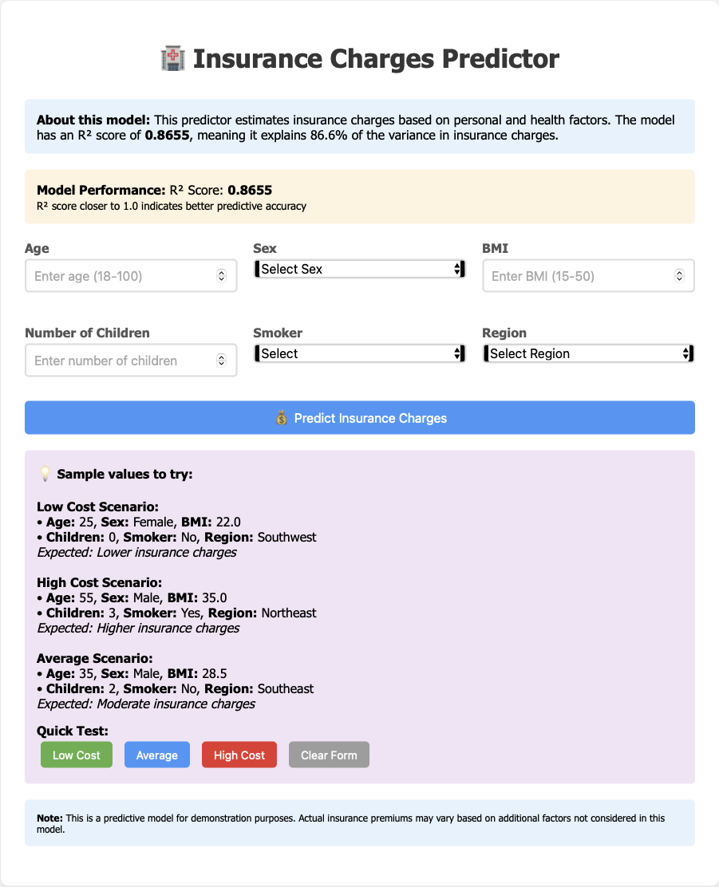
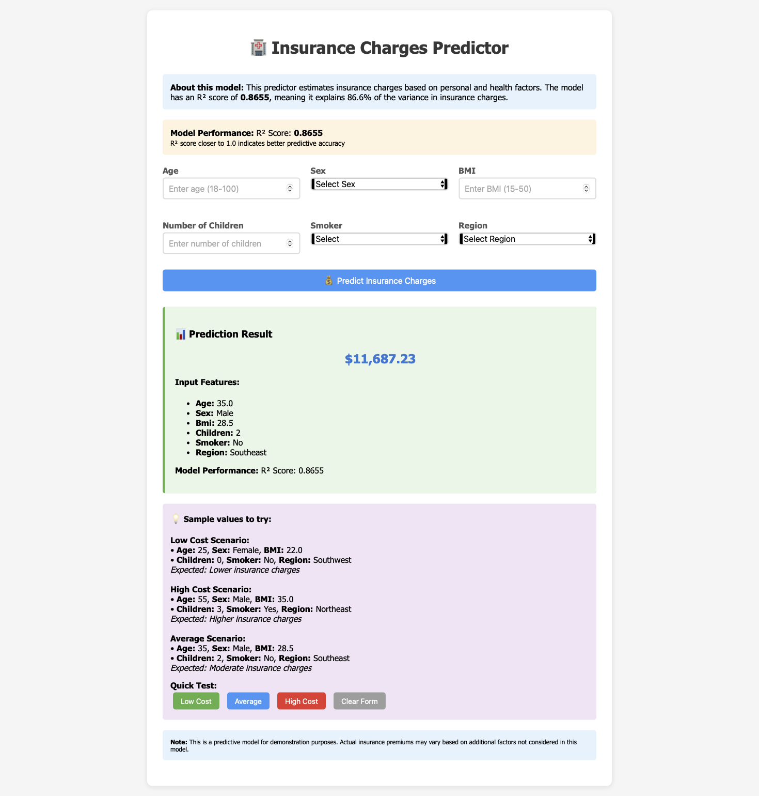

You're absolutely right! Let me update the README.md to include those important details:

# 🏥 Insurance Charges Prediction App

A machine learning web application that predicts insurance medical charges based on personal and health factors. Built with Flask, scikit-learn, and Docker.


## 📊 Project Overview

**Primary Focus**: This project showcases a complete Flask web application with machine learning integration, Docker containerization, and REST API development.

This application uses a trained Random Forest regression model to predict insurance charges based on:
- **Personal Information**: Age, Sex, Region
- **Health Factors**: BMI, Smoking Status
- **Family**: Number of Children

> **⚠️ Model Update Notice**: The current model achieves an R² score of **0.8655**. We are actively working on improving the feature engineering and hyperparameter tuning to reach our target of **0.98+ R² score**. The model will be updated in the next release.

## 🎯 Project Focus & Goals

This project demonstrates:
- ✅ **Flask Web Development**: Complete web application with forms and templates
- ✅ **REST API Design**: JSON API for programmatic access
- ✅ **Docker Containerization**: Production-ready deployment
- ✅ **Machine Learning Integration**: Scikit-learn model serving
- ✅ **Feature Engineering**: Data preprocessing pipeline
- ✅ **Model Serialization**: Pickle for model persistence

## 📁 Complete Project Structure

```
insurance-prediction-app/
├── 🐳 Deployment & Configuration
│   ├── Dockerfile                 # Container build instructions
│   ├── docker-compose.yml         # Multi-service orchestration
│   ├── requirements.txt           # Python dependencies
│   └── .dockerignore             # Files to exclude from Docker
│
├── 🔧 Application Code
│   ├── app.py                    # Flask application (main file)
│   ├── models/                   # Trained ML models
│   │   ├── model.pkl            # Serialized model
│   │   └── model_info.pkl       # Model metadata
│   └── frontend/       # Web templates
│       └── index.html           # Main web interface
│
├── 📓 Analysis & Development
│   ├── notebooks/                # Jupyter notebooks
│   │   ├── data_analysis.ipynb  # Exploratory data analysis
│   │   ├── model_training.ipynb # Model development & tuning
│   │   └── feature_engineering.ipynb # Feature experiments
│   └── train_model.py           # Training script
│
├── 📊 Data & Resources
│   ├── data/                     # Dataset directory
│   │   └── insurance.csv        # Original dataset
│   └── backups/                  # Model backups
│
└── 📚 Documentation
    ├── README.md                # This file
    └── screenshots/             # Application screenshots
```

## 📓 Notebooks Directory Explained

The `notebooks/` directory contains Jupyter notebooks for data science work:

- **`data_analysis.ipynb`**: Exploratory data analysis, visualizations, and insights
- **`model_training.ipynb`**: Model experimentation, hyperparameter tuning, and evaluation
- **`feature_engineering.ipynb`**: Feature creation and transformation experiments

> **Note**: These notebooks are for development and analysis purposes only. They are excluded from Docker production builds but are essential for model improvement and experimentation.

## 🖼️ Screenshots

### Web Interface


### Prediction Result


## 🚀 Quick Start

### Prerequisites
- Python 3.9+ or Docker
- Git

### Method 1: Run with Python (Development)

```bash
# Clone the repository
git clone https://github.com/yourusername/insurance-prediction-app.git
cd insurance-prediction-app

# Install dependencies
pip install -r requirements.txt

# Run the application
python app.py
```

The app will be available at: http://localhost:5001

### Method 2: Run with Docker (Production)

```bash
# Clone the repository
git clone https://github.com/GFiaMon/lab-flask-ds-deployment.git
cd insurance-prediction-app

# Build and run with Docker
docker-compose up -d
```

The app will be available at: http://localhost:5001

## 🐳 Docker Deployment Guide

### Understanding the Docker Setup

This project uses both:
- **`Dockerfile`**: Defines how to build the application container
- **`docker-compose.yml`**: Manages the container runtime and future services

### Quick Docker Commands

```bash
# Start the application (recommended)
docker-compose up -d

# View logs
docker-compose logs -f

# Stop the application
docker-compose down

# Rebuild with changes
docker-compose up -d --build
```

### Manual Docker Commands (Alternative)

```bash
# Build the image
docker build -t insurance-prediction-app .

# Run the container
docker run -d -p 5001:5001 --name insurance-app insurance-prediction-app
```

## 🔧 API Usage

### Web Interface
Visit `http://localhost:5001` to use the interactive web form.

### REST API Endpoint

```bash
curl -X POST http://localhost:5001/api/predict \
  -H "Content-Type: application/json" \
  -d '{
    "age": 35,
    "sex": "male",
    "bmi": 28.5,
    "children": 2,
    "smoker": "no",
    "region": "southeast"
  }'
```

## 🎯 Current Model & Future Improvements

### Current Model (v1.0)
- **Algorithm**: Random Forest Regressor
- **R² Score**: 0.8655
- **Features**: Basic feature engineering with BMI categories and interactions

### Planned Improvements (v2.0)
- 🔄 Enhanced feature engineering
- 🎯 Hyperparameter optimization
- 📊 Advanced model architectures
- 🎯 Target: R² score > 0.98

## 🛠️ Technology Stack

- **Backend**: Flask, Python
- **Machine Learning**: scikit-learn, pandas, numpy
- **Frontend**: HTML5, CSS3, JavaScript
- **Containerization**: Docker, Docker Compose
- **Model**: Random Forest Regressor
- **Analysis**: Jupyter Notebooks

## 📈 Development Workflow

1. **Data Analysis** → `notebooks/data_analysis.ipynb`
2. **Feature Engineering** → `notebooks/feature_engineering.ipynb`
3. **Model Training** → `notebooks/model_training.ipynb`
4. **Web Development** → `app.py` + `insurance_frontend/`
5. **Containerization** → `Dockerfile` + `docker-compose.yml`

## 🤝 Contributing

We welcome contributions, especially in these areas:

1. **Model Improvement**: Feature engineering, hyperparameter tuning
2. **Web Interface**: UI/UX enhancements
3. **API Features**: Additional endpoints, authentication
4. **Documentation**: Tutorials, examples

## 📝 License

This project is licensed under the MIT License - see the [LICENSE](LICENSE) file for details.

## 🆘 Support

If you encounter any issues:

1. Check the Docker logs: `docker-compose logs -f`
2. Ensure the models directory exists with `model.pkl` and `model_info.pkl`
3. Verify port 5001 is available on your system

## 📞 Contact

Your Name - [Guillermo Fiallo-Montero]

Project Link: [https://github.com/yourusername/insurance-prediction-app](https://github.com/yourusername/insurance-prediction-app)

---

**⭐ Don't forget to star this repository if you find it useful!**

---

*Note: This project primarily showcases Flask web development with machine learning integration. The current model serves as a demonstration, with ongoing improvements to predictive accuracy. Actual insurance premiums may vary based on additional factors not considered in this model.*